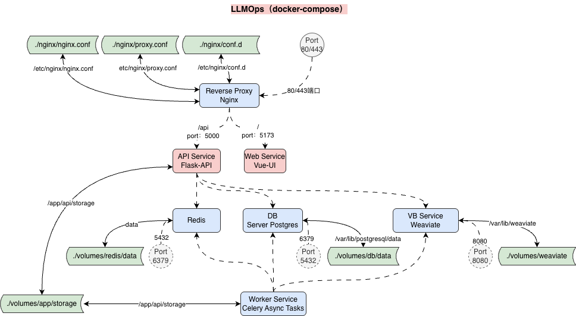

# LLMOps

## Architecture



#### **1. Frontend Layer**

- **Tech Stack:** Vue + WebSocket
- **Functions:**
    - Implements the WebUI (web interface)
    - Provides identity authentication
    - Ensures cross-platform compatibility

------

#### **2. Chat Engine**

- **Tech Stack:** LangChain + Flask + Redis
- **Functions:**
    - Orchestrates multi-Agent dialogue flows
    - Handles coordination and turn-taking
    - Maintains conversational context (session persistence)

------

#### **3. Knowledge Base Retrieval**

- **Tech Stack:** Elasticsearch + Weaviate + Neo4j
- **Functions:**
    - Enables multi-source retrieval and hybrid search
    - Performs graph reasoning and relationship inference

------

#### **4. Backend Services**

- **Tech Stack:** Flask + PostgreSQL + Redis
- **Functions:**
    - Manages user authentication and access control
    - Maintains audit and operation logs

------

#### **5. Deployment Platform**

- **Tech Stack:** Docker + Kubernetes
- **Functions:**
    - Supports multi-environment deployment
    - Provides elasticity and automatic scaling

------

#### **6. Intent Recognition**

- **Tech Stack:** Sklearn + BERT + ONNX
- **Functions:**
    - Integrates multiple model types for intent classification
    - Supports model fusion and hot updates

#### **7. Monitoring and Observability**

- **Tech Stack:** Prometheus + Grafana + Arize
- **Functions:**
    - Implements full-chain monitoring and alerting
    - Enables system-level log aggregation and analysis

------

### PostgreSQL server

```
brew services restart postgresql@16
brew services stop postgresql@16
```

### Flask-Migrate

```
pip install flask-migrate

flask db init
flask --app app.http.app routes
flask --app app.http.app db init
flask --app app.http.app db migrate -m "init db migration"
flask --app app.http.app db current -v   # shows DB’s current revision (likely None right now)
flask --app app.http.app db heads        # shows code head (you saw e9355133b2f5)
```

### Redis

```
docker pull redis
docker images
docker run --name redis-dev -d -p 6379:6379 redis
docker exec -it redis-dev redis-cli -p 6379 PING 

docker ps
docker start redis-dev
docker stop redis-dev

docker exec -it redis-dev redis-cli
```

### Weaviate

```
docker images
docker run --name weaviate-dev -d -p 8080:8080 -p 50051:50051 cr.weaviate.io/semitechnologies/weaviate:1.32.8
docker ps
docker stop weaviate-dev
docker start weaviate-dev
```

### Celery

```
celery -A app.http.app.celery worker --loglevel INFO --logfile storage/log/celery.log
```

## Pytest

```
pytest -q test/internal/handler/test_app_handler.py::TestAppHandler::test_completion -q -s
```

### JWT

Generate JWT_SECRET_KEY

```
openssl rand -base64 24 | tr -dc 'A-Za-z0-9' | head -c 32; echo
```

### OLLMA

http://127.0.0.1:11434/api/generate

```
ollama
ollama list
ollama run deepseek-r1:1.5b

writing manifest
success
>>> hello
Hello! How can I assist you today? 😊

>>> /?
Available Commands:
  /set            Set session variables
  /show           Show model information
  /load <model>   Load a session or model
  /save <model>   Save your current session
  /clear          Clear session context
  /bye            Exit
  /?, /help       Help for a command
  /? shortcuts    Help for keyboard shortcuts

Use """ to begin a multi-line message.

>>> /bye
ollama stop deepseek-r1:1.5b
```

### MinerU

https://huggingface.co/spaces/opendatalab/MinerU

```
conda activate MinerU
mineru -p executive-summary-2020.pdf -o ./ --source huggingface
```

### pip-tools

```
pip-compile requirements.in
pip-sync requirements.txt
pip-compile requirements-dev.in
pip-sync requirements-dev.txt
```

### Gunicorn

```
# Binds the server to all network interfaces on port 8080
gunicorn -b 0.0.0.0:8080 -w 1 -k sync app:app

# Runs 4 worker processes
gunicorn -w 4 app:app

# High-concurrency IO-bound behavior
gunicorn -k gevent -w 2 --worker-connections 1000 app:app

# Long-running request handling for worker crash / restart behavior
gunicorn --timeout 60 app:app

# ML / large memory apps/ Flask factory
gunicorn -w 2 --preload app:app

# Real thread-level race conditions with 2 processes & 8 OS threads per process
gunicorn -w 2 -k gthread --threads 8 app:app

# Example
gunicorn \
  --bind 0.0.0.0:5001 \
  --workers 5 \
  --worker-class gevent \
  --timeout 600 \
  --preload \
  app.http.app:app
  
```

### NLTK

```
python -m nltk.downloader \
  punkt \
  punkt_tab \
  averaged_perceptron_tagger \
  averaged_perceptron_tagger_eng \
  -d ./internal/core/unstructured/nltk_data
```

### BedRock

In AWS CloudShell

```
python3 -m venv ~/.venv
source ~/.venv/bin/activate
pip install ipython

aws bedrock list-foundation-models
```

```
import boto3
bedrock_client = boto3.client(service_name="bedrock")
bedrock_client.list_foundation_models()
```

```
ssh-keygen -t rsa
cat .ssh/id_rsa.pub
git clone git@github.com:aws-samples/amazon-bedrock-workshop.git
```

### Phoenix

```
export OTEL_EXPORTER_OTLP_ENDPOINT="http://localhost:6006/v1/traces"  # or wherever Phoenix is hosted
export OTEL_EXPORTER_OTLP_PROTOCOL=http/protobuf
export OTEL_TRACES_EXPORTER=otlp
export OTEL_SERVICE_NAME=openai-test
```

### Arize

```
openssl s_client -connect otlp.arize.com:443 -showcerts </dev/null  | awk '/BEGIN CERTIFICATE/{f="y"} f{print} /END CERTIFICATE/{f=""}' \

chmod 755  /Users/linghuang/Git/LLMOps/study-template/arize-ax/otlp.arize.com.chain.pem

openssl s_client -servername otlp.arize.com -connect otlp.arize.com:443 -showcerts </dev/null 2>/dev/null \
| awk '/BEGIN CERTIFICATE/,/END CERTIFICATE/' \
> "/Users/linghuang/Git/LLMOps/study-template/arize-ax/otlp.arize.com.chain.pem"


import certifi
os.environ['GRPC_DEFAULT_SSL_ROOTS_FILE_PATH'] = "LLMOps/study-template/arize-ax/otlp.arize.com.chain.pem"

import certifi
os.environ['GRPC_DEFAULT_SSL_ROOTS_FILE_PATH'] = certifi.where()

```

### Disclaimer

This repository and its contents are collected and shared solely for academic and research purposes.
All code, data, and related materials are intended to support independent study, experimentation, and learning.

If you believe any part of this repository inadvertently includes content that should not be shared publicly or may
cause concern, please contact me immediately. I will review and, if necessary, remove the material without delay.

I do not claim ownership of any third-party data or content and have made every effort to respect intellectual property
and privacy rights.
