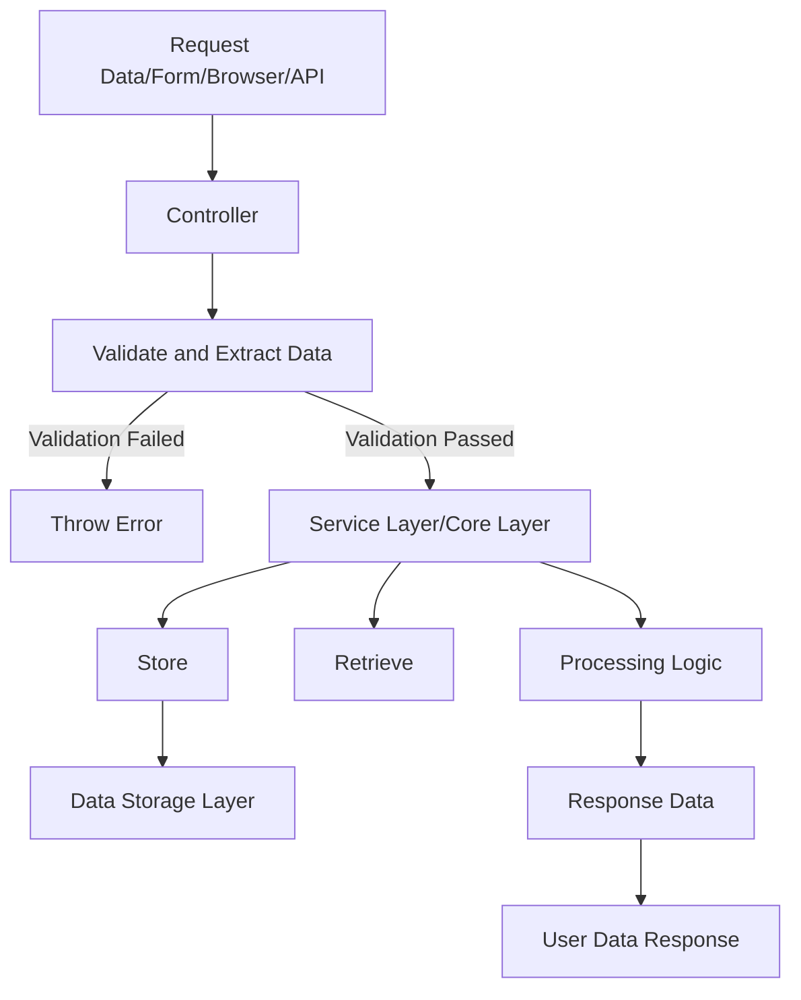

# LLMOps

### App Framework

```
|---app  // Application entry points collection
|   ├---__init__.py
|   └---http
|---config  // Application configuration files
|   ├---__init__.py
|   ├---config.py
|   └---default_config.py
|---internal  // All internal application directories
|   ├---core  // LLM core files, integrating LangChain, LLM, Embeddings, and other non-business logic code
|   |   |---agent  // Agent-related components
|   |   |---chain  // Chain-related logic
|   |   |---prompt  // Prompt templates and configurations
|   |   |---model_runtime  // LLM model runtime management
|   |   |---moderation  // Content moderation logic
|   |   |---tool  // Various tools and utilities
|   |   |---vector_store  // Vector database interactions
|   |   └---...
|   ├---exception  // Common exception handling
|   |   ├---__init__.py
|   |   ├---exception.py
|   |   └---...
|   ├---extension  // Flask extension files
|   |   ├---__init__.py
|   |   ├---database_extension.py
|   |   └---...
|   ├---handler  // Route handlers and controllers
|   |   ├---__init__.py
|   |   ├---account_handler.py
|   |   └---...
|   ├---middleware  // Middleware components, including authentication checks
|   |   ├---__init__.py
|   |   └---middleware.py
|   |   └---...
|   ├---migration  // Database migration files (auto-generated)
|   |   ├---versions
|   |   └---...
|   ├---model  // Database models
|   |   ├---__init__.py
|   |   ├---account.py
|   |   └---...
|   ├---router  // Application routing files
|   |   ├---__init__.py
|   |   ├---router.py
|   |   └---...
|   ├---schedule  // Scheduled and periodic tasks
|   |   ├---__init__.py
|   |   └---...
|   ├---schema  // Request and response schema definitions
|   |   ├---__init__.py
|   |   └---...
|   ├---server  // Application server components (corresponding to the `app` folder)
|   |   ├---__init__.py
|   |   └---...
|   ├---service  // Service layer components
|   |   ├---__init__.py
|   |   ├---oauth_service.py
|   |   └---...
|   ├---task  // Task management, supporting immediate and delayed tasks
|   |   ├---__init__.py
|   |   └---...
|---pkg  // External package extensions
|   ├---__init__.py
|   |---oauth  // OAuth authentication modules
|   |   ├---__init__.py
|   |   ├---github_oauth.py
|   |   └---...
|   └---...
|---storage  // Local storage
|---test  // Testing directory
|---.env  // Application configuration file
|---.gitignore  // Git ignore file
|---requirements.txt  // Dependency management for third-party packages
└---README.md  // Project documentation
```


```mermaid
graph TD;
    A[Request Data/Form/Browser/API] --> B[Controller];
    B --> C[Validate and Extract Data];

    C -->|Validation Failed| D[Throw Error];
    C -->|Validation Passed| E[Service Layer/Core Layer];

    E --> F[Store];
    E --> G[Retrieve];
    E --> H[Processing Logic];

    F --> I[Data Storage Layer];
    H --> J[Response Data];
    J --> K[User Data Response];
```

### Start PostgreSQL server

```
brew services restart postgresql@16
brew services stop postgresql@16
```

### Flask-Migrate

```
pip install flask-migrate

flask db init

flask --app app.http.app routes

flask --app app.http.app db init

flask --app app.http.app db migrate -m "init db migration"
```

### Redis

```
docker pull redis
docker images
docker run --name redis-dev -d -p 6379:6379 redis
docker ps
docker start redis-dev
docker stop redis-dev

docker exec -it redis-dev redis-cli
```

### Weaviate

```
docker run -p 8080:8080 -p 50051:50051 cr.weaviate.io/semitechnologies/weaviate:1.32.8
```

### Phoenix

```
export OTEL_EXPORTER_OTLP_ENDPOINT="http://localhost:6006/v1/traces"  # or wherever Phoenix is hosted
export OTEL_EXPORTER_OTLP_PROTOCOL=http/protobuf
export OTEL_TRACES_EXPORTER=otlp
export OTEL_SERVICE_NAME=openai-test
```

### BedRock

In AWS CloudShell

```
python3 -m venv ~/.venv
source ~/.venv/bin/activate
pip install ipython

aws bedrock list-foundation-models
```

```
import boto3
bedrock_client = boto3.client(service_name="bedrock")
bedrock_client.list_foundation_models()
```

```
ssh-keygen -t rsa
cat .ssh/id_rsa.pub
git clone git@github.com:aws-samples/amazon-bedrock-workshop.git
```

```
# 1) Create a key (press Enter for defaults)
ssh-keygen -t ed25519 -C "linghypshen@gmail.com"

# 2) Start agent & add key
eval "$(ssh-agent -s)"
ssh-add ~/.ssh/id_ed25519

# 3) Add the public key to GitHub (copies it to clipboard)
pbcopy < ~/.ssh/id_ed25519.pub
# GitHub → Settings → SSH and GPG keys → New SSH key → paste

# 4) Point your repo at the SSH URL and push
git remote set-url origin git@github.com:lingduoduo/LLMOps.git
ssh -T git@github.com    # should say "Hi <your-username>!"
git push
```