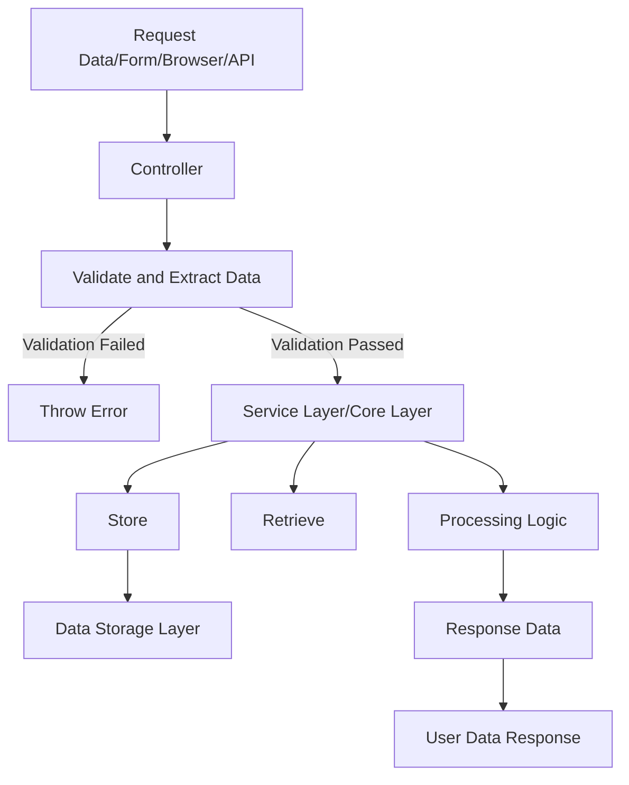

# LLMOps

```mermaid
graph TD;
    A[Request Data/Form/Browser/API] --> B[Controller];
    B --> C[Validate and Extract Data];

    C -->|Validation Failed| D[Throw Error];
    C -->|Validation Passed| E[Service Layer/Core Layer];

    E --> F[Store];
    E --> G[Retrieve];
    E --> H[Processing Logic];

    F --> I[Data Storage Layer];
    H --> J[Response Data];
    J --> K[User Data Response];
```

